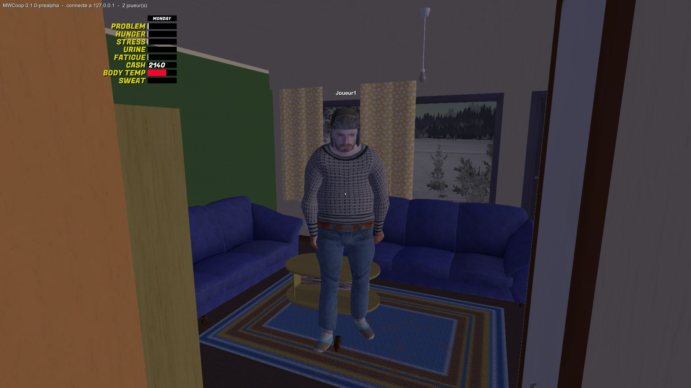
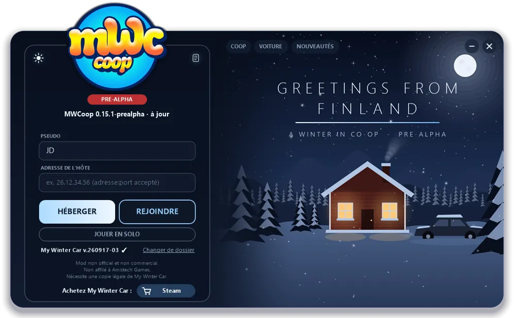
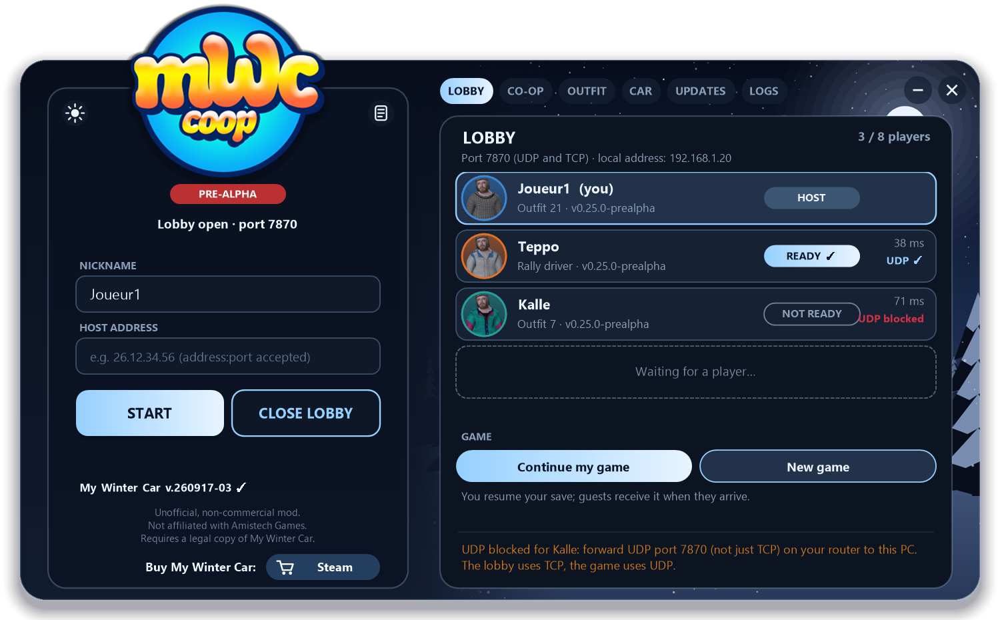
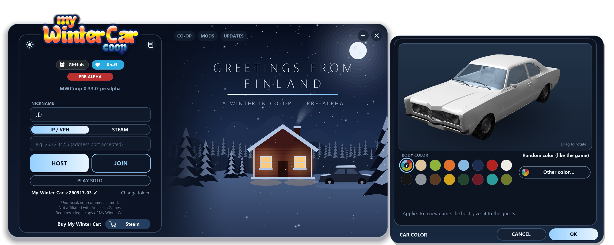

<p align="center">
  
</p>

<p align="center">
  
  <a href="https://github.com/Parricidium/MWCoop/releases"></a>
</p>

<p align="center">
  <a href="https://store.steampowered.com/app/4164420/"></a>
</p>
<p align="center">
  <b>This mod needs a legitimately owned copy of My Winter Car.</b> No game data is included here.
</p>

> [!WARNING]
> **PRE-ALPHA, rebuilt from scratch.** Players see each other, share the host's time, weather and world (doors,
> phone, TV, bills, shops, NPCs, quests), drive and ride together, and rebuild the car together part by part and
> bolt by bolt; shop together with separate wallets. Not yet tested much between real friends: expect bugs and send
> your logs (round LOGS button of `MWCoop.exe`).

<p align="center">
  
</p>
<p align="center"><i>The host ("Joueur1") as seen by a guest, wearing an outfit picked among the game's NPCs.</i></p>

<p align="center">
  
</p>
<p align="center"><i>The launcher: host, join or play solo; it keeps the mod up to date by itself. Snow, smoke and firelight are animated.</i></p>

<p align="center">
  
</p>
<p align="center"><i>The lobby: players, outfits, versions and ping; the host picks the game and launches everyone.</i></p>

<p align="center">
  
</p>
<p align="center"><i>CAR tab: the CORRIS color for a new game, previewed in 3D (the model is read from your own game, missing parts and wheels included).</i></p>

# MWCoop — My Winter Car in co-op

A co-op mod for **My Winter Car** (Steam), by the authors of [VCCoop](https://github.com/Parricidium/VCCoop),
[SACoop](https://github.com/Parricidium/SACoop) and [JACoop](https://github.com/Parricidium/JACoop). One player hosts
their world; friends join **that** world: same save, same time, same weather — and, as the roadmap goes, the same
car being rebuilt bolt by bolt.

*[Version française plus bas.](#version-française)*

## Install

1. Open the game folder (Steam: right-click *My Winter Car* > *Manage* > *Browse local files*).
2. Copy everything from the [latest release](https://github.com/Parricidium/MWCoop/releases) zip next to
   `mywintercar.exe`: `version.dll`, `MWCoop.exe` and the `MWCoop` folder.
3. Start `MWCoop.exe`. It updates the mod by itself on every start.

No other loader is needed (MWCoop does not use MSCLoader).

## Playing

- **Host**: click HOST: the launcher opens a **lobby** where friends show up with their outfit, version and ping.
  Pick *Continue my game* or *New game*, then LAUNCH: everyone's game starts. Open port **7870** in **UDP and TCP** on
  your router, or use a VPN (Radmin VPN, ZeroTier…) and share your VPN address.
- **Join**: enter the host's address, click READY in the lobby (or JOIN IN GAME if the host is already playing). Your game receives the host's save and enters their game by itself as soon as
  the host is playing. **Your own save is never touched**: guests play in a separate profile (`MWCoop\profils\invite`).
- In game: **F10** opens the co-op menu (players and ping, outfit, chat, *go to a player*), **T** opens the chat.

## Status

| Done | Next |
|---|---|
| Own loader (`version.dll`), auto-updating launcher with a lobby | Every solo action for guests (windshield scraping, penalties...) |
| Players visible (NPC outfits), walking, crouching | Items held in the hand (now carried at their real place) |
| Host's save sent to guests (isolated profile), also right after a new game | Real-world testing with friends |
| Host's time, day and weather (clouds, rain, temperature); time only fast-forwards when every player sleeps | |
| World items without an ID (jerry cans, car jack, engine hoist, axe, buckets...) carried and seen by all | |
| Host back to the main menu: guests follow and rejoin the next game with a fresh save | |
| Car doors, hoods, boot lids synced in real time; house light switches; dashboard, lights, windows, handbrake... seen by all | |
| Passenger seats (ENTER near the front passenger seat or the back seat); passengers can use the key, handbrake, windows, heater... while someone drives | |
| The rest of the world: bills (paid by one, electricity back for everyone, only the payer pays), mailbox, electricity meter, fuses, stove, thermostats, sauna, parts catalog orders and parcels, lottery numbers... | |
| Players: NPC driving pose at the wheel (car or truck), head following the camera even 360 degrees; on foot, upper body follows the gaze; real crouch; arms down when idle | |
| NPC lines and players' swearing heard by everyone; fluids (fuel, oil, coolant, brake fluid) and wear | |
| Food eaten, drinks drunk, trash thrown away disappear for everyone | |
| Doors, light switches, TV and CD player, sent to a guest who joins mid-game | |
| Vehicles: the driver sits at the wheel for everyone, with engine sound, turning wheels and lights; parked ones stay in place | |
| Animated players (NPC animations): walking, sitting, crouching, smoking, drinking, carrying, waving | |
| Car mechanics: parts installed/removed, every bolt turn, parts carried and dropped, paint (parts and body), hand adjustments | |
| Money: income shared by everyone, separate wallets; shopping seen by all (bags, items) | |
| Traffic and passers-by driven by the host (roads, bus, train) | |
| Shared jobs: a job started by one and finished by another counts for both, no double pay | |
| Wiring, windshield and dashboard buttons of every vehicle | |
| Launcher CAR tab: pick the CORRIS color for a new game, with a 3D preview | |
| Chat, F10 menu | |
| Respawn: in co-op, death no longer ends the game; the player picks where to come back (apartment or parents' house), even after a car crash | |
| Sync audit (F10 > SYNCHRO): census of every interactive object and which module syncs it, host/guest state comparison every 15 s (lasting differences logged as DESYNC), local actions that are not shared | |
| Outfits in 3D: turntable preview in F10 > APPEARANCE and in the launcher's OUTFIT tab (portrait gallery), player portraits in the lobby; CDs put back in their case or a player seen in place; gas pump terminal screen (PIN, amount) seen by all | |
| Guests' waiting screen instead of the main menu (connection, host, save download, loading); lobby UDP check (tells the host to forward UDP, not just TCP); LOGS tab with "open folder" and "zip to send"; GTA-style F10 menu with keyboard navigation; CD cases and CDs shared; launcher car preview always the complete stock CORRIS | |
| Taxi (passengers, doors), engine state handed over with the wheel, window frost and scraping, towing rope, pub/inspection/flea market/coffee/bus purchases, outgoing calls, mail orders, worn clothes, bolts of freshly installed parts, firewood, septic tanks, co-op save at the toilet without kicking guests | |

The full list is in [docs/FEUILLE-DE-ROUTE.md](docs/FEUILLE-DE-ROUTE.md) (French).

## How it works

My Winter Car runs on Unity 5.0 with its logic in PlayMaker state machines. `version.dll` is a proxy loaded by the game:
it hooks Unity's Mono, loads `MWCoop\MWCoop.dll` on the main thread, and can isolate a profile (saves, registry,
single-instance lock) so a guest's own save stays untouched. The mod then drives the game through its state machines
(time skip events, menu buttons, weather objects) and replicates the host's world over UDP.

## Building

Requirements: Visual Studio 2022 Build Tools (C++ x64), .NET SDK 8 (only its C# compiler is used), the game installed.

```bat
build.cmd
```

`build\version.dll`, `build\MWCoop.dll` and `build\MWCoop.exe`. Set `MWC_JEU` if the game is not in the default
Steam folder. `run\make-testinstances.ps1` and `run\test.ps1` start isolated, off-screen test instances.

## Disclosure

Developed with AI assistance (Claude), directed and tested by a human maintainer. My Winter Car belongs to
Amistech Games; this project is not affiliated with them.

---

# Version française

**MWCoop** est un mod coopératif pour **My Winter Car** (Steam). Un joueur héberge son monde, ses amis rejoignent
**ce** monde : même sauvegarde, même heure, même météo — et, au fil de la feuille de route, la même voiture remontée vis
par vis.

## Installation

1. Ouvrez le dossier du jeu (Steam : clic droit sur *My Winter Car* > *Gérer* > *Parcourir les fichiers locaux*).
2. Copiez-y tout le contenu du zip de la [dernière version](https://github.com/Parricidium/MWCoop/releases), à côté de
   `mywintercar.exe` : `version.dll`, `MWCoop.exe` et le dossier `MWCoop`.
3. Lancez `MWCoop.exe`. Il met le mod à jour tout seul à chaque démarrage.

Aucun autre chargeur n'est nécessaire (MWCoop n'utilise pas MSCLoader).

## Jouer

- **Héberger** : cliquez sur HÉBERGER : le lanceur ouvre un **salon** où vos amis apparaissent avec leur tenue, leur
  version et leur ping. Choisissez *Continuer ma partie* ou *Nouvelle partie*, puis LANCER : le jeu de chacun démarre.
  Ouvrez le port **7870** en **UDP et TCP** sur votre box, ou utilisez un VPN (Radmin VPN, ZeroTier…) et donnez votre
  adresse VPN.
- **Rejoindre** : entrez l'adresse de l'hôte, cliquez sur PRÊT dans le salon (ou REJOINDRE EN JEU si l'hôte joue
  déjà). Votre jeu reçoit la sauvegarde de l'hôte et entre dans sa partie tout seul
  dès que l'hôte joue. **Votre propre sauvegarde n'est jamais touchée** : l'invité joue dans un profil à part
  (`MWCoop\profils\invite`).
- En jeu : **F10** ouvre le menu coop (joueurs et ping, apparence, tchat, *aller vers un joueur*), **T** le tchat.

## Avancement

Fait : chargeur maison, lanceur à mise à jour automatique, joueurs visibles (tenues des PNJ), sauvegarde de l'hôte
envoyée aux invités, heure/jour/météo de l'hôte, portes et interrupteurs, véhicules conduits vus par tous,
mécanique (pièces montées/démontées, chaque cran de vis, pièces portées et lâchées), revenus partagés avec
porte-monnaie séparés, achats vus par tous (sacs, articles), joueurs animés (marcher, s'asseoir, fumer, boire,
porter, saluer, dormir : l'horloge commune accélère), salon du lanceur, conducteur assis au volant avec le bruit du moteur, les roues et les phares, tchat, menu F10.
Fait aussi : peinture (pièces et carrosserie) et réglages à la main (carburateur, molettes).
Fait aussi (0.6) : circulation et passants de l'hôte, boulots communs (validés pour tous, sans double paie),
câblage et tableaux de bord, couleur de la voiture choisie dans le lanceur avec aperçu 3D.
Fait aussi (0.7) : salon du lanceur, sommeil (l'horloge commune accélère), état des portes pour l'invité qui arrive.
Fait aussi (0.8) : liquides et usure, nourriture et boissons consommées chez tous, voix des PNJ et jurons, nouvelle
partie partagée (l'hôte sauvegarde avant d'envoyer).
Fait aussi (0.9) : le temps ne passe vite que quand tout le monde dort, objets du monde sans ID (bidons, cric,
palan...), aperçu de la voiture complet, retour de l'hôte au menu suivi par les invités.
Fait aussi (0.10) : portières, capots et coffres des véhicules, interrupteurs de la maison ; avatars : pose de
conduite d'un PNJ (voiture ou camion), tête qui suit la caméra au volant (même à 360°), buste qui suit le regard,
vrai accroupi, bras le long du corps au repos.
Fait aussi (0.11) : places passagers (ENTRÉE près de la place avant droite ou de la banquette) ; un passager peut
tourner la clé, tirer le frein à main, ouvrir les vitres, régler le chauffage... pendant qu'un autre conduit, c'est
rejoué chez le conducteur ; tableau de bord, voyants, vitres, frein à main, ceintures vus par tous.
Fait aussi (0.12) : le reste du monde -- factures (payées par l'un, le courant revient pour tous, seul le payeur
paie), boîte aux lettres, compteur électrique, fusibles, cuisinière, thermostats, sauna, commandes de pièces par
catalogue et colis, numéros du loto... ; plus d'objets physiques suivis (plaques de puits, mobilier du pub...).
Fait aussi (0.13) : téléphone (les appels sont tirés par l'hôte : il sonne chez tous ; celui qui décroche entend
l'appel, les autres en ont les conséquences -- boulot de bois accepté, repère sur la carte, commande prise --, puis
le téléphone raccroche chez eux) ; commandes de pièces par téléphone (annuaire) ; petites annonces de pièces
identiques chez tous ; colis de la poste suivis ; et une relecture complète de la synchronisation : un rejeu n'est
jamais renvoyé, un événement du monde (horloge, hockey, radio) n'est plus joué deux fois, l'argent et le corps de
celui qui rejoue ne bougent jamais (même après un minuteur), un message trop gros ne bloque plus l'automate du jeu.
Option de secours : `SynchroMonde=0` dans la section `[Coop]` de `MWCoop\mwcoop.ini` coupe la synchronisation
générique du monde si elle gêne.
Fait aussi (0.13.1, retours de JD) : places passagers à la bonne place (yeux comme le conducteur, plus haut à
l'arrière), icône passager seulement en visant le siège ; feux de recul et toute lampe des voitures vus par tous ;
plus de son moteur superposé en sortant d'une voiture (le moteur de la copie restait relancé) ; moteur laissé
tournant entendu par tous ; programme de la télé identique chez tous (grille de l'hôte).
Fait aussi (0.14, retours de JD) : vrai accroupi à deux niveaux (genoux pliés, puis à genoux penché pour regarder
dessous) ; places passagers comme le conducteur (on entre jusqu'au siège, ENTRÉE s'assoit sur place à la bonne
hauteur, on ressort sur place) ; portières qui battent comme chez celui qui les a ouvertes (angle de charnière,
butées) ; pare-brise et pièces qui ne cassent plus sur la copie d'une voiture conduite par un autre ; portes
automatiques du magasin et barrière du market pour tous les joueurs ; écran de la pompe à essence vu par tous ;
voitures garées de la station identiques ; PNJ (vendeurs, caissières, clients) aux mêmes places et mêmes gestes ;
rayons des magasins qui se vident en direct quand un autre prend un article.
Fait aussi (0.15, retours de JD) : portières refermées en les poussant vues par tous (et toujours manipulables
chez l'autre) ; sacs de courses ouverts chez tous, articles sortis avec les mêmes identifiants et leur physique
suivie ; cigarette : l'avatar la tient dans la main, la porte à la bouche tant que le joueur tire et souffle la
fumée en relâchant ; chaleur de l'habitacle de la voiture conduite par un autre reprise (le passager se réchauffe).
Fait aussi (0.15.1) : nouveau logo de MWCoop (lanceur, icône, GitHub) ; fond du lanceur animé (neige qui tombe,
fumée de la cheminée et du pot, fenêtres qui vacillent, étoiles et étoile filante la nuit) ; lanceur dix fois moins
gourmand (fond mis à l'échelle une seule fois).
Fait aussi (0.16, retours de JD) : portières, coffres et capots refaits : l'hôte arbitre l'ordre des clics (deux
clics croisés ou un « spam » du clic gauche finissent pareil chez tous), la fermeture n'est envoyée que quand la
portière claque vraiment (appuyer puis relâcher avant ne la ferme plus chez l'autre), et chez l'autre elle se
referme d'un coup, sans que son corps ou sa souris puissent l'arrêter. Celui qui la manie en dernier donne l'angle.
Fait aussi (0.17, retours de JD) : réapparition — en coop, mourir ne renvoie plus au menu (l'hôte emmenait tout le
monde) : on choisit où revenir, l'appartement ou la maison des parents, même après un accident de voiture (la voiture
reste conduisible). Portières et coffres ouverts par l'un pendant qu'un autre conduit : la voiture ne s'envole plus
(les portières suivent l'autre en restant des corps physiques, plus jamais figées). [Coop] Reapparition=0 la coupe.
Fait aussi (0.18) : audit de la synchro (F10 > SYNCHRO) — recensement de tout ce qui est interactif dans le jeu et du
module qui le partage (dumps/recensement.txt), comparaison hôte/invités toutes les 15 s (écarts durables notés DESYNC
dans le journal et dumps/desync.txt), actions d'un joueur qui ne partent pas chez les autres (dumps/actions.txt).
Fait aussi (0.19, d'après l'analyse complète du 04/10) : portière avant gauche (verrou soudé chez celui qui ne conduit
pas, fermeture des portières de gauche), lumière intérieure plus rejouée deux fois ; PNJ : tous les calques d'animation
(le client de la station tient son téléphone à l'oreille chez tous), mêmes clients présents, mouvements lissés ;
objets posés dans un coffre ou l'habitacle : restent en place pendant que l'autre conduit ; objet empoché dès sa
création : disparaît chez tous ; revenus du monde (allocations, aide au logement, paies) comptés une seule fois ;
train partagé ; machines à sous et poker de la station : un joueur à la fois, les autres regardent, gains gardés.
Fait aussi (0.19.1) : lanceur, onglet JOURNAUX : journaux de tous les profils (invité, essais), les plus récents en
premier ; au démarrage, il signale un dernier lancement fait sans le mod (antivirus, version.dll, autre dossier du jeu).
Fait aussi (0.19.2) : dossier du jeu en lecture seule (droits Windows, antivirus) : profils et journaux basculent dans
%LOCALAPPDATA%\MWCoop au lieu de bloquer le jeu sur l'avertissement de départ ; trace de chargement du mod au même endroit.
Fait aussi (0.20, lot 2 de l'analyse) : taxi MACHTWAGEN (passagers, portières, recalage), état du moteur et de la
batterie repris avec le volant ; givre des vitres et grattage ; corde de remorquage (vue et tirée chez tous) ; achats au
bar, au contrôle technique, à la brocante, au café et au bus (l'invité ne paie plus ce que l'hôte commande) ; appels
sortants, commandes par courrier et colis ; vêtements portés (veste, combinaison, casque) ; boulons des pièces juste
montées, bois (bûches, fendeuse), fosses septiques ; sauvegarde aux toilettes en coop sans éjecter les invités (un
invité peut la demander).
Fait aussi (0.21, retours de JD) : écran d'attente des invités à la place du menu principal (connexion, l'hôte crée
ou charge la partie, réception de la sauvegarde en %, chargement ; boutons du menu bloqués) ; salon : test UDP de chaque
invité avant LANCER (« UDP bloqué : l'hôte doit rediriger le port UDP, pas seulement TCP ») ; onglet JOURNAUX bien
visible avec « Ouvrir le dossier » et « Créer un zip à envoyer » (sur le Bureau) ; menu F10 façon GTA (navigation au
clavier) ; boîtiers de CD ouverts/fermés et CD sortis vus par tous ; aperçu du lanceur : la CORRIS complète d'origine
(pièces de série, jantes et pneus), plus l'état de la sauvegarde.
Fait aussi (0.22, retours de JD) : tenues en 3D comme dans GTA — le jeu photographie chaque tenue sous 16 angles
(MWCoop\cache\skins) ; F10 > APPARENCE montre le personnage qui tourne, le lanceur a un onglet TENUE (aperçu qu'on fait
tourner, galerie de portraits) et le salon affiche le portrait de chaque joueur ; CD remis dans un boîtier, une chaîne
ou un lecteur de voiture : posé à sa place chez tous (plus de chute) ; écran du terminal de la pompe (code, montant) vu
par tous jusqu'au bout.
Fait aussi (0.22.1, retours de JD) : voiture conduite par un autre fluide chez le passager (plus d'à-coups), banquette
et coffre qui ne tremblent plus en roulant ; un objet tenu par un autre ne pousse plus la voiture ; nuages et neige du
jour identiques chez l'hôte et les invités.
À venir : essais réels entre amis.
La liste complète : [docs/FEUILLE-DE-ROUTE.md](docs/FEUILLE-DE-ROUTE.md).

Développé avec l'aide d'une IA (Claude), dirigé et testé par un humain. My Winter Car appartient à Amistech Games ;
ce projet n'a aucun lien avec eux.
