<p align="center">
  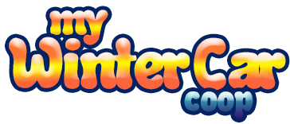
</p>

<p align="center">
  
  <a href="https://github.com/Parricidium/MWCoop/releases"></a>
</p>

<p align="center">
  <a href="https://store.steampowered.com/app/4164420/"></a>
</p>
<p align="center">
  <b>This mod needs a legitimately owned copy of My Winter Car.</b> No game data is included here.
</p>

<p align="center">
  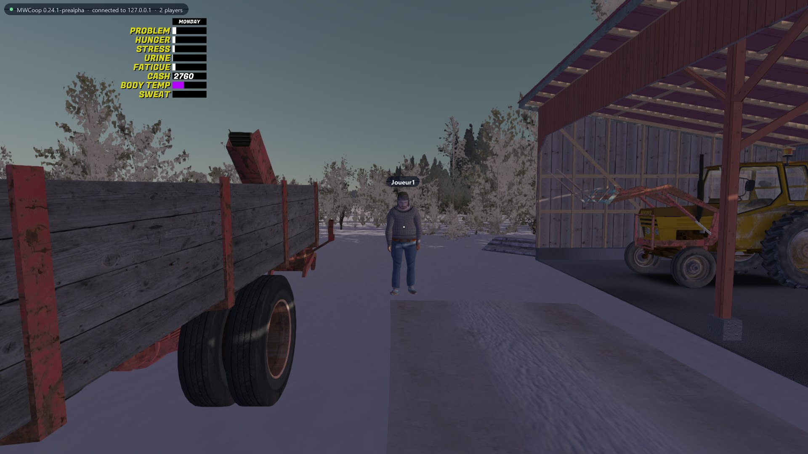
</p>

# MWCoop — My Winter Car in co-op

A co-op mod for **My Winter Car** (Steam), by the authors of [VCCoop](https://github.com/Parricidium/VCCoop),
[SACoop](https://github.com/Parricidium/SACoop) and [JACoop](https://github.com/Parricidium/JACoop). One player hosts
their world; friends join **that** world: same save, same time, same weather, the same car rebuilt bolt by bolt,
the same shops, NPCs, jobs and bills — with a wallet each.

The mod and its launcher speak **English and French** (the launcher follows Windows, the game follows the launcher).

> [!WARNING]
> **PRE-ALPHA.** Almost everything is tested between two game instances on one PC; real games between friends have
> only just started. Expect bugs and send your logs: launcher, **LOGS** tab, *Create a zip to send*.

*[Version française plus bas.](#version-française)*

## Screenshots

### The launcher

`MWCoop.exe` installs and updates the mod by itself, checks your game, and runs the **lobby**: players with their
outfit portrait, version, ping and a UDP check; the host picks *Continue* or *New game*, then everyone's game starts.

<p align="center">
  
</p>

<table>
  <tr>
    <td width="50%">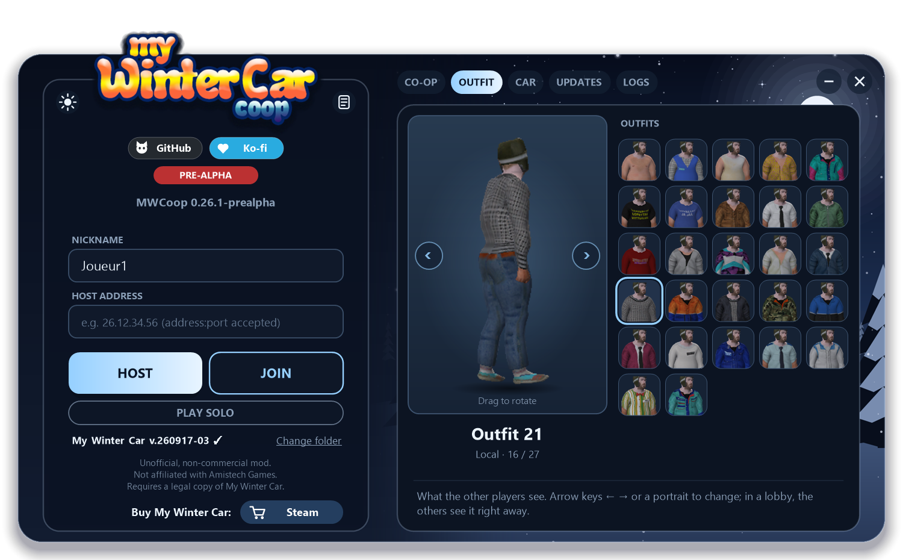</td>
    <td width="50%"></td>
  </tr>
  <tr>
    <td align="center"><b>Outfit</b>: pick how the others see you, turning 3D preview and portraits read from your own game</td>
    <td align="center"><b>Car</b>: the CORRIS colour for a new game, previewed in 3D</td>
  </tr>
  <tr>
    <td width="50%">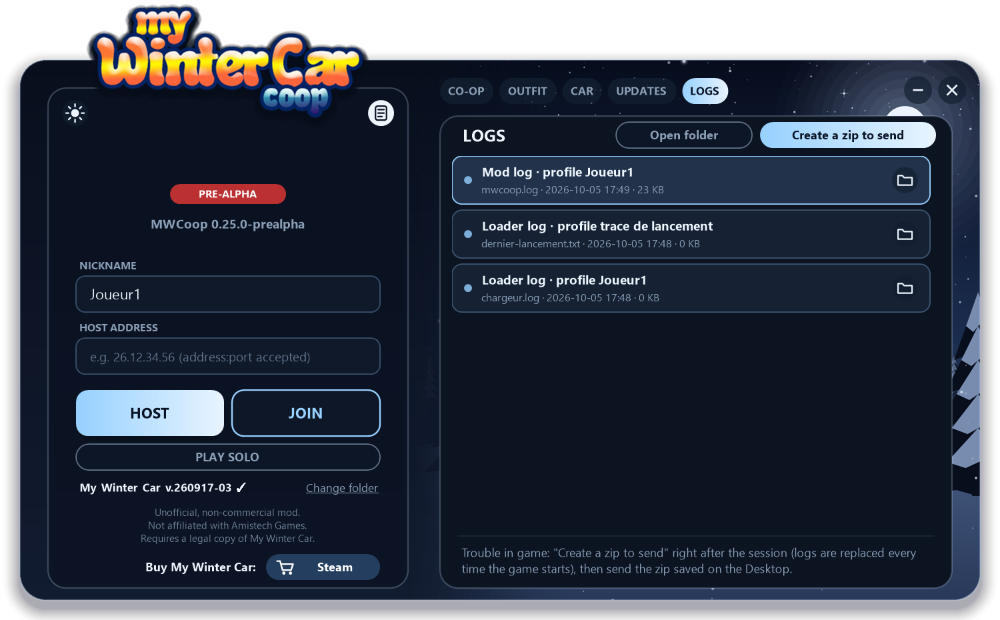</td>
    <td width="50%">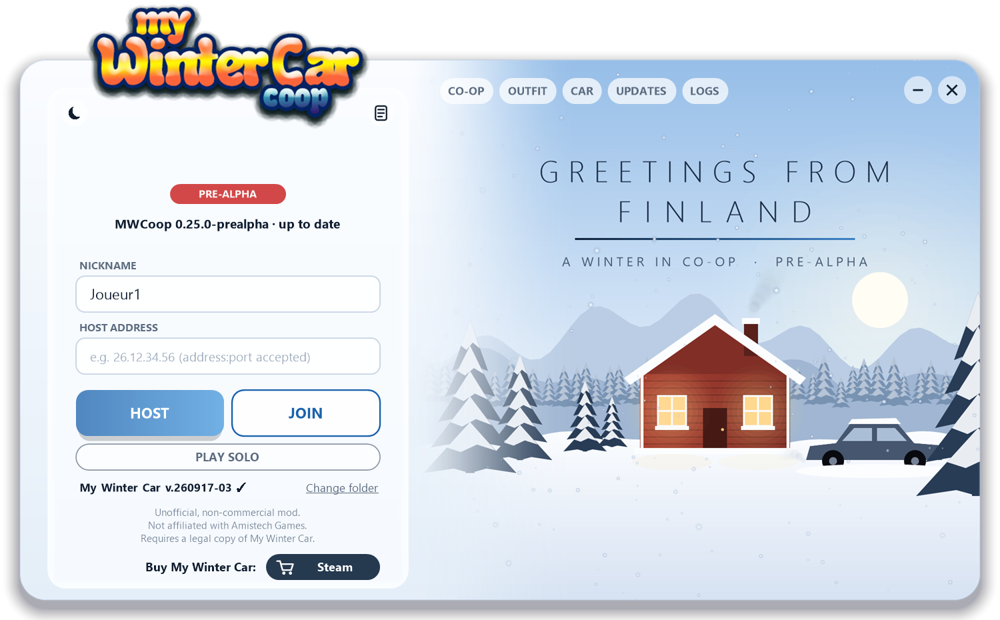</td>
  </tr>
  <tr>
    <td align="center"><b>Logs</b>: every log, one click to zip them for a bug report</td>
    <td align="center">Light or dark theme, English or French, animated winter scene</td>
  </tr>
</table>

### In game

<table>
  <tr>
    <td width="50%">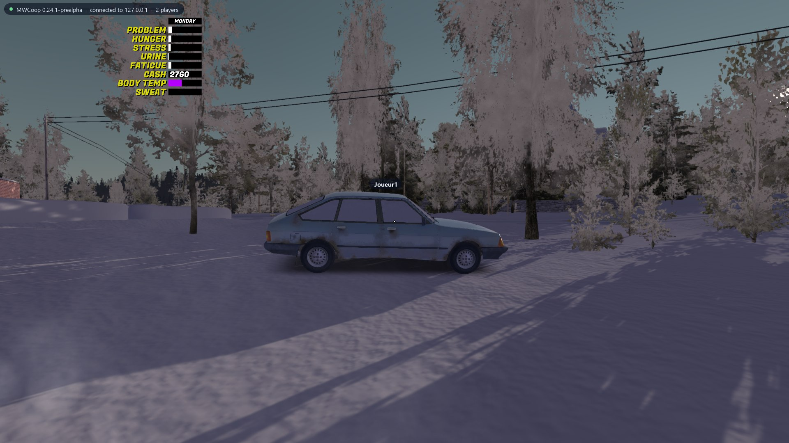</td>
    <td width="50%">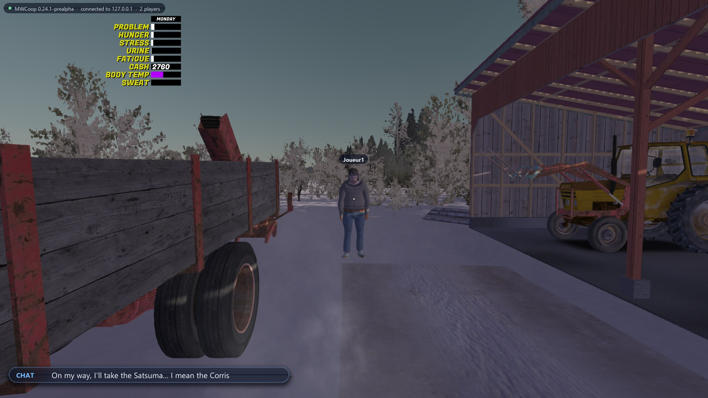</td>
  </tr>
  <tr>
    <td align="center">Cars driven by the others: real physics, engine sound, lights, the driver at the wheel</td>
    <td align="center">Chat (<b>T</b>), name tags above the players, short messages for what the others do</td>
  </tr>
  <tr>
    <td width="50%">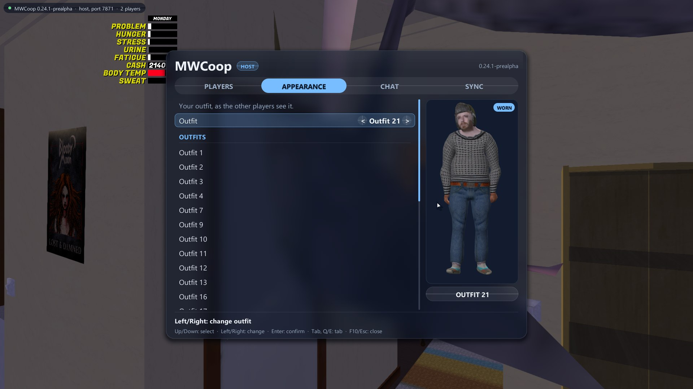</td>
    <td width="50%">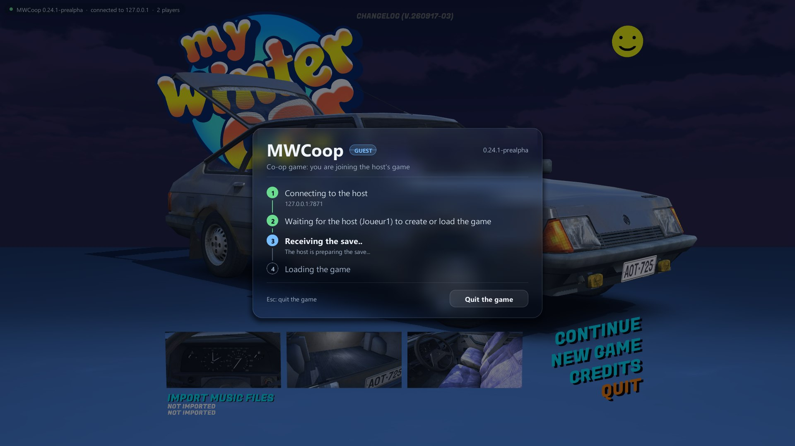</td>
  </tr>
  <tr>
    <td align="center"><b>F10</b> menu: players, outfit with a live 3D preview, chat, sync audit — mouse or keyboard</td>
    <td align="center">Guests wait on this screen while the host's save arrives, then join by themselves</td>
  </tr>
  <tr>
    <td width="50%">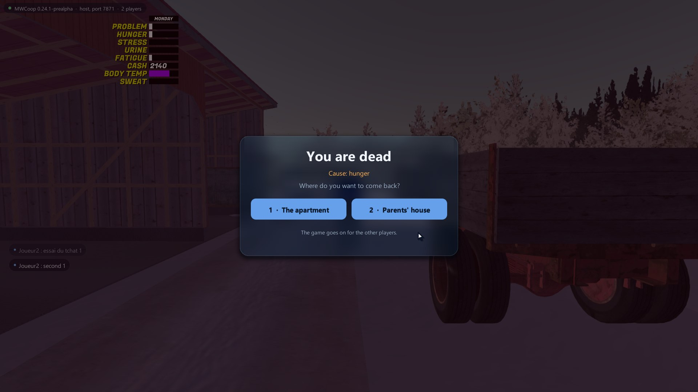</td>
    <td width="50%">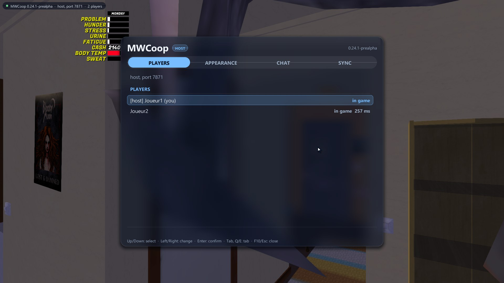</td>
  </tr>
  <tr>
    <td align="center">Dying no longer ends the co-op game: pick where you come back</td>
    <td align="center">Players and ping; Enter or click to go to a player</td>
  </tr>
</table>

---

## Contents

- [Screenshots](#screenshots)
- [Download and install](#download-and-install)
- [Playing](#playing)
- [Features](#features)
- [Options](#options)
- [Network](#network)
- [Known issues](#known-issues)
- [How it works](#how-it-works)
- [Building](#building)
- [Version française](#version-française)

---

## Download and install

1. Open the game folder (Steam: right-click *My Winter Car* > *Manage* > *Browse local files*).
2. Copy everything from the [latest release](https://github.com/Parricidium/MWCoop/releases) zip next to
   `mywintercar.exe`: `version.dll`, `MWCoop.exe` and the `MWCoop` folder.
3. Start `MWCoop.exe`. It updates the mod by itself on every start.

No other loader is needed. From a Steam install, the launcher starts the game from a copy in
`%LOCALAPPDATA%\MWCoop\My Winter Car` (same data, linked folders): Steam would otherwise load Windows' `version.dll`
before the mod's.

**MSCLoader** (experimental): MWCoop and MSCLoader run side by side since 0.31.3. The launcher's **MODS** tab
(0.32) installs MSCLoader from its official GitHub (its own installer refuses a game folder that already contains a
`version.dll`), turns it on or off for the next launch, lists your mods and edits their options (gear icon; applied
at the next game launch). Mods are not synced between players yet.

### Antivirus warning

A few antivirus engines sometimes flag `MWCoop.exe` (Windows Defender `Wacatac.B!ml`, CrowdStrike, DeepInstinct…).
These are **machine-learning guesses**, not a known virus: the `!ml` / `confidence` part of the name means the
engine only thinks the file *looks like* a downloader, because the launcher is a new, unsigned program that
downloads the mod's updates from GitHub and starts the game. No virus signature matches it, and most engines
(around 67 of 71 on VirusTotal) find nothing.

- Everything is open source in this repository; you can read the code and build it yourself (see *Building*).
- Every release has a `SHA256SUMS-<version>.txt` file: compare it with your files
  (`Get-FileHash MWCoop.exe` in PowerShell), and look the hash up on [VirusTotal](https://www.virustotal.com).
- Since 0.26.2 the launcher no longer starts any hidden helper (no `tar.exe`, no `cmd.exe`): the update zip and the
  Steam folder links are handled inside the launcher, and both executables carry full version information.
- If Defender quarantines it: *Windows Security* > *Virus & threat protection* > *Protection history* > *Allow*, or add
  an exclusion for the game folder.

## Playing

Pick the network above the address field: **STEAM** (easiest) or **IP / VPN**.

- **Through Steam** (everyone needs the Steam version of the game): the host clicks HOST. The launcher opens a
  **Steam lobby** (friends only) and lists the host's online Steam friends: click **INVITE**. A friend accepts the
  invite in Steam (or clicks **JOIN** in MWCoop.exe, Steam selected) and lands in the same lobby as over IP: outfits,
  versions, READY, *Continue* / *New game*, then START launches everyone's game. No port to open, no firewall, no
  address: the traffic goes through Steam's relays. Steam avatars show in the lobby and next to the nicknames in game.
  So that an invite accepted while MWCoop is **closed** opens MWCoop (not the game without the mod), follow the
  guide that opens when you pick STEAM (or click *Steam launch option* > GUIDE): it copies the Steam launch option (`"...\MWCoop.exe" %command%`) to paste
  in *Properties > General > Launch options*. Once the game is running, more friends can still be invited in game
  (**F10 > Invite Steam friends**, or Shift+Tab).
- **Host** (IP / VPN): click HOST. The launcher opens a **lobby** where friends show up with their outfit, version and ping.
  Pick *Continue my game* or *New game*, then START: everyone's game starts. Forward port **7870** in **UDP and TCP**
  on your router, or use a VPN (Radmin VPN, ZeroTier…) and share your VPN address.
- **Join**: enter the host's address, click READY in the lobby (or JOIN IN GAME if the host is already playing). Your
  game receives the host's save and enters their game by itself. **Your own save is never touched**: guests play in
  a separate profile (`MWCoop\profils\invite`).
- In game: **F10** opens the co-op menu (mouse or arrows), **T** the chat, **Esc** closes them.

## Features

- **Players**: everyone sees the others with the outfit they picked among the game's NPC clothes, their name tag,
  walking, crouching (two levels), sitting on furniture, smoking, drinking, carrying, waving, punching, the finger,
  drunk sway, passing out; the head follows the camera, even at the wheel.
- **One world**: the host's save is sent to the guests (also right after a new game); host's time, day, weather,
  clouds, snow and temperature; time only fast-forwards when **every** player sleeps. A guest who joins mid-game gets
  the doors, switches, TV, CDs and everything else as they are.
- **Vehicles**: the driver sits at the wheel for everyone with engine sound, turning wheels, lights, wipers and the
  dashboard; smooth for passengers; doors, hoods and boot lids that swing for real; **passenger seats** (ENTER near a
  seat) where a passenger can use the key, handbrake, windows, heater…; taxi, towing rope, frost and scraping,
  crash damage (glass, dents, suspension), fires.
- **Car building**: parts installed and removed, every bolt turn, parts carried and dropped, paint, carburettor and
  knob adjustments, wiring, fluids (fuel, oil, coolant, brake fluid) and wear, jacks, lift and engine hoist.
- **Money and shops**: income shared, **a wallet each** (only the buyer pays); shopping seen by everyone (bags,
  shelves emptying live), pub, flea market, inspection, coffee, bus, gas pump terminal, restaurant trays and plates.
- **NPCs**: same people in the same places with the same gestures; customers, fights and police checkpoints followed
  by the player they deal with; their lines heard by everyone — and stopped for everyone when they hang up or get
  interrupted.
- **Everyday life**: bills (paid by one, power back for all), mailbox, phone calls (a guest can answer), parts
  catalogue orders and parcels, lottery, fuses, stove, sauna, cooking (sausages, coffee, spoilage), wood fires and
  firewood, kilju, septic tanks, jobs shared without double pay, slot machines one player at a time.
- **Death and saves**: in co-op, dying no longer ends the game — pick the apartment or the parents' house; co-op save
  at the toilet without kicking the guests (a guest can ask for it); the host back to the menu takes everyone along.
- **Interface**: frosted-glass panels in the launcher's colours, mouse cursor in the menus, guest waiting screen with
  the save download, sync audit (F10 > SYNC) that compares host and guests every 15 s and lists local actions not
  shared yet.

The detailed list, version by version, is in [docs/FEUILLE-DE-ROUTE.md](docs/FEUILLE-DE-ROUTE.md) (French).

## Options

`MWCoop\mwcoop.ini`, section `[Coop]` (the launcher writes most of them for you):

| Key | Effect |
|---|---|
| `Port=7870` | Game port (UDP) and lobby port (TCP) |
| `Langue=fr` / `en` | Language of the in-game texts (written by the launcher) |
| `Flou=0` | Plain panels instead of the blurred glass (very old PCs) |
| `Reapparition=0` | Death ends the game as in solo |
| `EcranAttente=0` | Guests see the game's main menu instead of the waiting screen |
| `SynchroMonde=0` | Emergency switch: turns off the generic world sync if it gets in the way |

## Network

Through **Steam**: Steam's peer-to-peer networking (Valve relays), with the game's own Steam app id; nothing to open.
Through **IP / VPN**: the host's game listens on **UDP 7870** (the game) and the launcher on **TCP 7870** (the lobby). Both must be reachable:
the lobby shows *UDP blocked* for a guest whose UDP test fails. Up to 8 players per lobby.

## Known issues

- Items held in the hand are carried at their real place, not glued to the avatar's hand.
- A guest who joins after a restaurant order does not see the trays already on the counter.
- Some NPC reactions (fights, services) are only checked between test instances so far.
- Your feedback from real games is what drives the next versions: send the zip from the LOGS tab.

## How it works

My Winter Car runs on Unity 5.0 with its logic in PlayMaker state machines. `version.dll` is a proxy loaded by the
game: it hooks Unity's Mono, loads `MWCoop\MWCoop.dll` on the main thread, and isolates a profile (saves, registry,
single-instance lock) so a guest's own save stays untouched. The mod then drives the game through its own state
machines (it replays on each machine what one player did) and replicates the host's world over UDP.

## Building

Requirements: Visual Studio 2022 Build Tools (C++ x64), .NET SDK 8 (only its C# compiler is used), the game installed.

```bat
build.cmd
```

`build\version.dll`, `build\MWCoop.dll` and `build\MWCoop.exe`. Set `MWC_JEU` if the game is not in the default
Steam folder. `run\make-testinstances.ps1` and `run\test.ps1` start isolated, off-screen test instances.

## Disclosure

Developed with AI assistance (Claude), directed and tested by a human maintainer. My Winter Car belongs to
Amistech Games; this project is not affiliated with them.

---

# Version française

**MWCoop** est un mod coopératif pour **My Winter Car** (Steam). Un joueur héberge son monde, ses amis rejoignent
**ce** monde : même sauvegarde, même heure, même météo, la même voiture remontée vis par vis, les mêmes magasins,
PNJ, boulots et factures — avec chacun son porte-monnaie.

Le mod et son lanceur parlent **français et anglais** (le lanceur suit Windows, le jeu suit le lanceur).

> [!WARNING]
> **PRÉ-ALPHA.** Presque tout est testé entre deux instances du jeu sur un même PC ; les vraies parties entre amis
> commencent tout juste. Attendez-vous à des bugs et envoyez vos journaux : lanceur, onglet **JOURNAUX**, *Créer un
> zip à envoyer*.

## Captures

<p align="center">
  
</p>
<p align="center"><i>Le lanceur : héberger, rejoindre ou jouer seul ; il tient le mod à jour tout seul. Neige, fumée et lueur du feu animées.</i></p>

Les captures ci-dessus (en anglais) montrent le salon, les onglets TENUE, VOITURE et JOURNAUX, le menu F10, le tchat,
l'écran d'attente des invités et l'écran de mort ; tout existe aussi en français.

## Installation

1. Ouvrez le dossier du jeu (Steam : clic droit sur *My Winter Car* > *Gérer* > *Parcourir les fichiers locaux*).
2. Copiez-y tout le contenu du zip de la [dernière version](https://github.com/Parricidium/MWCoop/releases), à côté de
   `mywintercar.exe` : `version.dll`, `MWCoop.exe` et le dossier `MWCoop`.
3. Lancez `MWCoop.exe`. Il met le mod à jour tout seul à chaque démarrage.

Aucun autre chargeur n'est nécessaire. Depuis une installation Steam, le lanceur démarre le jeu depuis une copie dans
`%LOCALAPPDATA%\MWCoop\My Winter Car` (mêmes données, dossiers liés) : sinon Steam fait charger la `version.dll` de
Windows avant celle du mod.

**MSCLoader** (expérimental) : MWCoop et MSCLoader fonctionnent ensemble depuis la 0.31.3. L'onglet **MODS** du
lanceur (0.32) installe MSCLoader depuis son GitHub officiel (son propre installateur refuse un dossier de jeu qui
contient déjà une `version.dll`), l'active ou le coupe pour le prochain lancement, liste vos mods et règle leurs options
(icône d'engrenage ; pris au prochain lancement du jeu). Les mods ne sont pas encore synchronisés entre joueurs.

### Alerte d'antivirus

Quelques antivirus signalent parfois `MWCoop.exe` (Windows Defender `Wacatac.B!ml`, CrowdStrike, DeepInstinct…). Ce
sont des **suppositions de leur apprentissage automatique**, pas un virus connu : le `!ml` / `confidence` du nom veut
dire que le moteur trouve seulement que le fichier *ressemble* à un téléchargeur, parce que le lanceur est un programme
récent, non signé, qui télécharge les mises à jour du mod sur GitHub et lance le jeu. Aucune signature de virus ne
correspond, et la grande majorité des moteurs (environ 67 sur 71 sur VirusTotal) ne trouvent rien.

- Tout le code est ouvert dans ce dépôt : on peut le lire et le compiler soi-même (voir *Compiler*).
- Chaque version publie un fichier `SHA256SUMS-<version>.txt` : comparez-le à vos fichiers
  (`Get-FileHash MWCoop.exe` dans PowerShell) et cherchez l'empreinte sur [VirusTotal](https://www.virustotal.com).
- Depuis la 0.26.2, le lanceur ne démarre plus aucun programme caché (ni `tar.exe`, ni `cmd.exe`) : le zip de mise à
  jour et les liens de dossiers pour Steam sont gérés par le lanceur lui-même, et les deux exécutables portent leurs
  informations de version complètes.
- Si Defender le met en quarantaine : *Sécurité Windows* > *Protection contre les virus et menaces* > *Historique de
  protection* > *Autoriser*, ou ajoutez une exclusion sur le dossier du jeu.

## Jouer

Choisissez le réseau au-dessus du champ d'adresse : **STEAM** (le plus simple) ou **IP / VPN**.

- **Par Steam** (tout le monde a la version Steam du jeu) : l'hôte clique HÉBERGER. Le lanceur ouvre un **salon
  Steam** (amis seulement) et liste ses amis Steam en ligne : cliquez sur **INVITER**. L'ami accepte l'invitation dans
  Steam (ou clique **REJOINDRE** dans MWCoop.exe, Steam choisi) et arrive dans le même salon que par IP : tenues,
  versions, PRÊT, *Continuer* / *Nouvelle partie*, puis LANCER démarre le jeu de chacun. Ni port à ouvrir, ni pare-feu,
  ni adresse : le trafic passe par les relais de Steam. Les avatars Steam s'affichent dans le salon et à côté des
  pseudos en jeu. Pour qu'une invitation acceptée MWCoop **fermé** ouvre MWCoop (et pas le jeu sans le mod), suivez
  le guide qui s'ouvre en choisissant STEAM (ou *Option de lancement Steam* > GUIDE) : il copie l'option de lancement Steam (`"...\MWCoop.exe" %command%`) à
  coller dans *Propriétés > Général > Options de lancement*. Une fois en jeu, on peut encore inviter des amis
  (**F10 > Inviter des amis Steam**, ou Maj+Tab).
- **Héberger** (IP / VPN) : cliquez sur HÉBERGER. Le lanceur ouvre un **salon** où vos amis apparaissent avec leur tenue, leur
  version et leur ping. Choisissez *Continuer ma partie* ou *Nouvelle partie*, puis LANCER : le jeu de chacun démarre.
  Ouvrez le port **7870** en **UDP et TCP** sur votre box, ou utilisez un VPN (Radmin VPN, ZeroTier…) et donnez votre
  adresse VPN.
- **Rejoindre** : entrez l'adresse de l'hôte, cliquez sur PRÊT dans le salon (ou REJOINDRE EN JEU si l'hôte joue
  déjà). Votre jeu reçoit la sauvegarde de l'hôte et entre dans sa partie tout seul. **Votre propre sauvegarde n'est
  jamais touchée** : l'invité joue dans un profil à part (`MWCoop\profils\invite`).
- En jeu : **F10** ouvre le menu coop (souris ou flèches), **T** le tchat, **Échap** les ferme.

## Fonctionnalités

- **Joueurs** : chacun voit les autres avec la tenue choisie parmi les vêtements des PNJ, leur pseudo, qui marchent,
  s'accroupissent (deux niveaux), s'assoient sur les meubles, fument, boivent, portent, saluent, donnent un coup de
  poing, font un doigt, titubent ivres, s'évanouissent ; la tête suit la caméra, même au volant.
- **Un seul monde** : la sauvegarde de l'hôte est envoyée aux invités (aussi juste après une nouvelle partie) ; heure,
  jour, météo, nuages, neige et température de l'hôte ; le temps n'accélère que quand **tout le monde** dort. Un invité
  qui arrive en cours de partie reçoit les portes, interrupteurs, télé, CD et le reste tels qu'ils sont.
- **Véhicules** : le conducteur est assis au volant chez tous, avec le bruit du moteur, les roues qui tournent, les
  phares, les essuie-glaces et le tableau de bord ; fluide pour les passagers ; portières, capots et coffres qui
  battent pour de vrai ; **places passagers** (ENTRÉE près d'un siège) d'où l'on peut tourner la clé, tirer le frein à
  main, ouvrir les vitres, régler le chauffage… ; taxi, corde de remorquage, givre et grattage, dégâts d'accident
  (vitres, tôle, suspension), incendies.
- **Mécanique** : pièces montées et démontées, chaque cran de vis, pièces portées et lâchées, peinture, réglages du
  carburateur et des molettes, câblage, liquides (essence, huile, liquide de refroidissement, de frein) et usure,
  crics, pont et palan.
- **Argent et magasins** : revenus partagés, **un porte-monnaie chacun** (seul l'acheteur paie) ; courses vues par
  tous (sacs, rayons qui se vident en direct), bar, brocante, contrôle technique, café, bus, terminal de la pompe,
  plateaux et assiettes du restaurant.
- **PNJ** : mêmes personnes aux mêmes endroits avec les mêmes gestes ; clients, bagarres et barrages de police suivis
  par le joueur concerné ; leurs répliques entendues par tous — et coupées chez tous quand ils raccrochent ou sont
  interrompus.
- **Vie quotidienne** : factures (payées par l'un, le courant revient pour tous), boîte aux lettres, téléphone (un
  invité peut décrocher), commandes par catalogue et colis, loto, fusibles, cuisinière, sauna, cuisine (saucisses,
  café, péremption), feux de bois et bûches, kilju, fosses septiques, boulots communs sans double paie, machines à
  sous un joueur à la fois.
- **Mort et sauvegardes** : en coop, mourir ne termine plus la partie — on revient à l'appartement ou chez les
  parents ; sauvegarde coop aux toilettes sans éjecter les invités (un invité peut la demander) ; l'hôte qui revient
  au menu emmène tout le monde.
- **Interface** : panneaux en verre aux couleurs du lanceur, curseur dans les menus, écran d'attente des invités avec
  le téléchargement de la sauvegarde, audit de la synchro (F10 > SYNCHRO) qui compare hôte et invités toutes les 15 s
  et liste les actions locales pas encore partagées.

La liste détaillée, version par version : [docs/FEUILLE-DE-ROUTE.md](docs/FEUILLE-DE-ROUTE.md).

## Options

`MWCoop\mwcoop.ini`, section `[Coop]` (le lanceur écrit la plupart pour vous) :

| Clé | Effet |
|---|---|
| `Port=7870` | Port du jeu (UDP) et du salon (TCP) |
| `Langue=fr` / `en` | Langue des textes en jeu (écrite par le lanceur) |
| `Flou=0` | Panneaux unis au lieu du verre flouté (PC très anciens) |
| `Reapparition=0` | La mort termine la partie comme en solo |
| `EcranAttente=0` | Les invités voient le menu du jeu au lieu de l'écran d'attente |
| `SynchroMonde=0` | Interrupteur de secours : coupe la synchro générique du monde si elle gêne |

## Réseau

Par **Steam** : le réseau pair-à-pair de Steam (relais de Valve), sous l'identifiant Steam du jeu ; rien à ouvrir.
Par **IP / VPN** : le jeu de l'hôte écoute en **UDP 7870** (la partie) et le lanceur en **TCP 7870** (le salon). Les deux doivent être
joignables : le salon affiche *UDP bloqué* pour un invité dont le test UDP échoue. Jusqu'à 8 joueurs par salon.

## Bugs connus

- Les objets tenus en main sont portés à leur vraie place, pas collés à la main de l'avatar.
- Un invité qui arrive après une commande au restaurant ne voit pas les plateaux déjà posés.
- Certaines réactions de PNJ (bagarres, services) ne sont vérifiées qu'entre instances de test pour l'instant.
- Vos retours de vraies parties guident les prochaines versions : envoyez le zip de l'onglet JOURNAUX.

## Compiler

Visual Studio 2022 Build Tools (C++ x64), SDK .NET 8 (seul son compilateur C# sert), le jeu installé : `build.cmd`.

Développé avec l'aide d'une IA (Claude), dirigé et testé par un humain. My Winter Car appartient à Amistech Games ;
ce projet n'a aucun lien avec eux.
